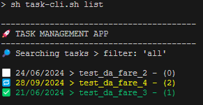
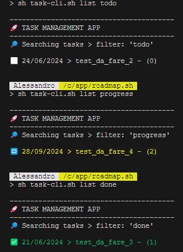
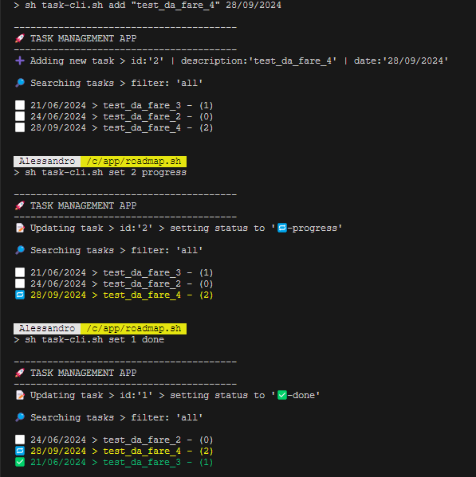

# 🚀 TASK MANAGEMENT APP

Project to solve [task-tracker](https://roadmap.sh/projects/task-tracker) challenge from [roadmap.sh](https://roadmap.sh/).

The program consists in a CLI task-tracker that allows you to track your todos.

All todos created will be stored in a simple json file <i><b>tasks.json</b></i> built automatically in the same directory of the execution.

## Prerequisites

- Node.js installed on your system.

## How to download

```bash
    git clone https://github.com/alebianchi96/cli-task-tracker.git
    cd cli-task-tracker
```

## How to use

```bash
    sh task-cli.sh <command> <params...>
```

## Available commands

- info -> to get info about all available commands

```bash
    ----------------------------------------
    🚀 TASK MANAGEMENT APP
    ----------------------------------------
    💡 Showing available commands in app
    
    > use 'sh task-cli.sh list' to list all tasks
    > use 'sh task-cli.sh list <status>' to list only tasks in a specific status
    
    > use 'sh task-cli.sh add <description> <dd/MM/yyyy>' to add a new task
    > use 'sh task-cli.sh updt <id> <description> <dd/MM/yyyy>' to update task info
    > use 'sh task-cli.sh set <id> <status>' to change a task status
    > use 'sh task-cli.sh delete <id>' to delete a task
```

## Available status

Defined in status_service.js, available status are:

- todo
- progress
- done
Each one has its own icon.

## Examples

```bash
sh task-cli.sh list
```

<br><br>
```bash
sh task-cli.sh list todo
sh task-cli.sh list progress
sh task-cli.sh list done
```

<br><br>
```bash
sh task-cli.sh add "test_da_fare_4" 28/09/2024
sh task-cli.sh set 2 progress
sh task-cli.sh set 1 done
```

